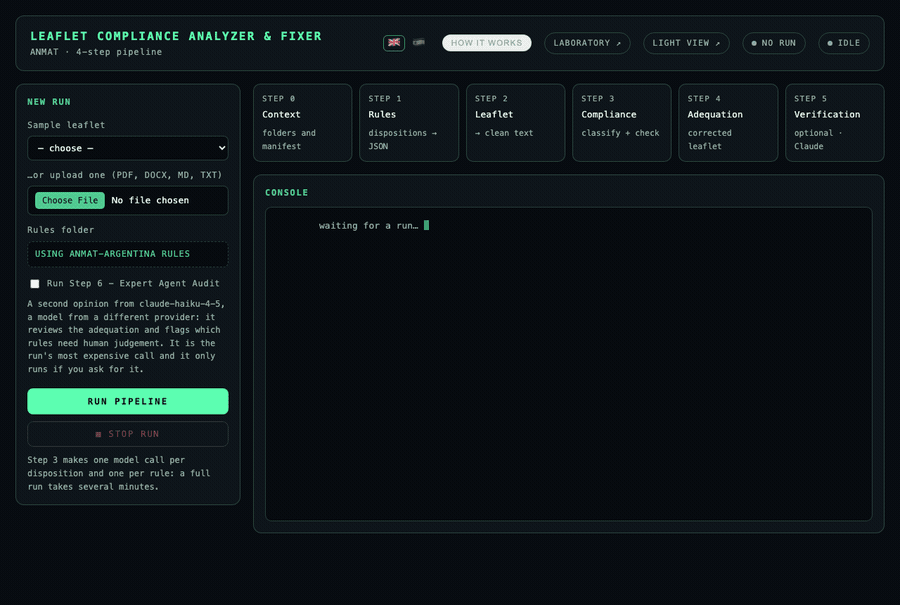

# pharma-leaflet-compliance-agent — AI compliance review for pharmaceutical leaflets

**Turns government regulations into machine-checkable rules, audit any drug leaflet
against them, and get back a compliance report plus a rewritten, compliant leaflet.**

> Built for pharma, but not welded to it: the engine works on any
> *regulation → document → compliance* problem. Swapping the industry means swapping the
> regulation corpus and the prompts, not the pipeline — see
> [Pharma is the first domain, not the only one](#pharma-is-the-first-domain-not-the-only-one).

In Argentina, every medicine leaflet ("prospecto") must comply with a growing body of
ANMAT regulations — dispositions and circulars that dictate, article by article, which
warnings, phrases and sections a leaflet is legally required to carry. Regulatory-affairs
teams do this review by hand: read the leaflet, read the norms, cross-check clause by
clause, then rewrite whatever is missing. It takes days per product, it does not scale,
and a single missed clause means a rejected submission.

This project does that review as a 4-step LLM pipeline. It reads the regulations, decides
which of them apply to the product in front of it, checks **every single rule** against the
leaflet with cited evidence, and produces the adequated leaflet with each change
highlighted and traced back to the article that demands it.

```
regulations (PDF) ──step 1──▶  rules as JSON
                                    │
leaflet (PDF/MD)  ──step 2──▶  clean text
                                    │
                               step 3 ──▶  compliance report (JSON/MD/HTML/PDF)
                                    │
                               step 4 ──▶  adequated leaflet (JSON/TXT/DOCX)
                                    │
                               step 5 ──▶  final verification with Claude (optional)
```

Every run is fully traceable: 15 regulations, 300 rules, one model call per rule, each
verdict carrying the evidence snippet that justifies it — and a token/cost report at the
end telling you exactly what the run cost and how much the prompt cache saved.



<sub>A real run on the sample leaflet, sped up. 15 dispositions classified, 4 of them
applicable, **85 rules verified one model call at a time** — 29 met, 33 not met, 17 that
cannot be decided without external information. **101 model calls, 6 min 32 s, US$ 0.23**,
with 81.5% of the input tokens served from the prompt cache (US$ 0.15 saved). Those are
the run's own numbers, read from the API and printed at the end of every run.</sub>

---

## Pharma is the first domain, not the only one

The problem this solves is not specific to medicine leaflets. It is the shape shared by
every regulated document: **a body of written norms on one side, a document that must
satisfy them on the other, and a human cross-checking clause by clause.** Nothing in the
engine knows what a leaflet is — it knows how to turn prose into checkable rules, decide
which ones apply, verify each one against a text with cited evidence, and rewrite what is
missing.

What is actually tied to pharma is small and lives in two places:

| Domain-bound | Domain-agnostic |
|---|---|
| The regulation corpus in `disposiciones/` (ANMAT dispositions and circulars) | The 5-step orchestration and the resumable `manifest.json` |
| The wording of the 6 prompts in `src/agents/prompts/` | The rules schema: objective, verification procedure, acceptance criteria, mandatory phrases, article reference |
| Report vocabulary ("disposition", "leaflet") | One call per rule, cited evidence, no partial analyses, two retry layers |
| — | Rule extraction in two passes, prompt caching, token/cost accounting, the web UI and the CLI |

**To point it at another industry you change the corpus and the prompts. You do not touch
the pipeline.** In practice: drop the new regulation PDFs into the folder that
`DISPOSITIONS_SOURCES_DIR` points at, run step 1 to extract the rules, and adapt the six
prompt files to the vocabulary of that domain. From step 2 onwards nothing changes — the
same classifier, the same rule-by-rule checker, the same remediation, the same reports.

The rules schema is deliberately generic. `must_include_phrases` is "the literal text the
norm requires", `article_reference` is "where it says so", `acceptance_criteria` is "when
it counts as met" — none of that is pharmaceutical. It fits food labelling, cosmetics,
medical devices, financial prospectuses, insurance policy wording, GMP/ISO procedures or a
contract checked against an internal policy, without a single change to the schema.

Two honest caveats. First, the identifiers in the code speak the original domain
(`prospecto`, `disposicion`): the engine does not care, but a reader of the source will see
pharmaceutical names. Second, the prompts are the real work of a new domain — they carry
the criteria a specialist would apply, and porting them well takes someone who knows that
regulation, not an afternoon of find-and-replace.

---

## Why it is built this way

These are the engineering decisions behind it, and the reasoning is what makes the output
trustworthy rather than merely plausible:

- **One model call per rule, never one big prompt.** Each call carries the leaflet + one
  rule and nothing else. It costs more tokens than batching, but rule 80 gets evaluated with
  exactly the same quality as rule 1 — no context degradation halfway down the list.
- **The expensive part is free.** Because the leaflet always goes first in the input and only
  the rule changes at the end, OpenAI's prompt cache covers the shared prefix and bills it at
  25%. A `prompt_cache_key` derived from the leaflet pins the routing so the cache actually
  hits. The run report shows the real saving, read from the API's `cached_tokens`.
- **No partial analyses, ever.** If a rule cannot be evaluated after its retries, the run
  fails. A report with unchecked rules would let step 4 conclude "this leaflet already
  complies" — the single most dangerous wrong answer in a regulatory workflow.
- **Two retry layers that do not overlap.** The SDK handles transport (429s, timeouts) with
  backoff; the pipeline handles responses that arrived but are unusable (unparseable,
  truncated). Retrying an SDK error again would just multiply the calls.
- **Rules are extracted in two passes.** A draft pass reads the regulation, then an audit
  pass re-reads the source, drops anything unsupported by the text and normalises the schema.
  One pass reliably misses requirements.
- **Every step is resumable.** Each step records its artifacts in a per-run
  `manifest.json` and the next step reads from there — no hardcoded paths between steps,
  so any run can be resumed from any step.
- **The whole pipeline is testable without spending a cent.** A smoke test replaces the LLM
  with canned responses and exercises all 4 steps, the 4 report formats and the DOCX
  formatting: 53 assertions, no network, no tokens.

## Tech stack

| Area | What is used |
|------|--------------|
| Language | Python 3.11+ |
| LLM | OpenAI **Responses API** (`openai>=2.0`), stateless, prompt caching, JSON mode |
| Orchestration | **LangGraph** for the compliance graph (4 nodes) |
| Web UI | **FastAPI** + Uvicorn, live run streaming over **SSE**, bilingual (EN/ES) zero-dependency vanilla JS front-end |
| Document input | **PyMuPDF** (native PDF text), **python-docx** (DOCX) |
| OCR (optional) | **DeepSeek-OCR** run locally via **PyTorch** + **Transformers** (Apple Silicon `mps`, CUDA or CPU) |
| Document output | **ReportLab** (primary PDF engine), **xhtml2pdf** (fallback), **python-docx** (tracked-changes-style highlighting) |
| Config | `.env` via **python-dotenv**, collapsed into a single frozen `Settings` object |
| Testing | Dependency-free smoke harness (`tests/smoke_pipeline.py`), runs in CI on every push |

## Requirements

- Python 3.11 or newer
- An OpenAI API key
- Optional: a local DeepSeek-OCR model, only if you need to process **scanned** PDFs

## Install

```bash
git clone https://github.com/alkimer/pharma-leaflet-compliance-agent.git
cd pharma-leaflet-compliance-agent

python -m venv .venv && source .venv/bin/activate
pip install -r requirements.txt

cp .env.example .env      # then fill in OPENAI_API_KEY
```

Local OCR is optional and only needed for **scanned** PDFs:

```bash
pip install -r requirements-ocr.txt   # torch + transformers
# then set OCR_MODEL_DIR in .env
```

## Usage

There are three ways to run it: the **CLI**, the **web UI**, and the **offline test lab**.

### 1. CLI

```bash
python run_pipeline.py
```

Interactive mode: it asks whether you already have generated rules, asks for the leaflet
(you can drag the file into the terminal) and runs the steps with detailed, coloured logs.

```bash
# No questions, for automation
python run_pipeline.py --prospecto ejemplos/prospectos/IBUPROFENO-DEMO.md --no-interactivo

# Generate the rules from scratch out of the regulation PDFs
python run_pipeline.py --generar-reglas

# Resume an existing run from a given step
python run_pipeline.py --listar-corridas
python run_pipeline.py --corrida 20260728-1745 --desde 3

# Force local OCR even if the PDF has a text layer
python run_pipeline.py --prospecto scanned.pdf --forzar-ocr

# With step 5's final verification (if omitted, you are asked)
python run_pipeline.py --verificar
```

### Step 5 — final verification (optional)

Steps 1 to 4 use OpenAI. Step 5 uses **Claude**, on purpose: a second model, from a
different provider, is likelier to catch what the first one waved through. It receives
the rules, the compliance report and both versions of the leaflet in a single call, and
answers two things:

1. **Is the adequation correct?** For every rule step 4 tried to resolve: `resuelta`,
   `parcial`, `no_resuelta` or `introduce_error`.
2. **What needs a human?** Rules that are ambiguous, not verifiable by an AI, that depend
   on a datum from the dossier, or that are a matter of professional judgement — with the
   concrete decision to be taken, not a vague "review this".

It lands in `verificacion_final.json` (structured) and `verificacion_final.txt`
(readable). It is **off by default**: it needs `ANTHROPIC_API_KEY` and it is the run's
most expensive call.

On a real ACICLOVIR run it flagged 19 reviewed adequations, 11 rules for human
intervention and 6 risks, for US$ 0.11 with `claude-haiku-4-5`.

### 2. Web UI

```bash
pip install -r requirements-web.txt
python run_web.py                 # opens http://127.0.0.1:8000
```

The same pipeline, no questions asked: upload the leaflet or pick an example, and watch the
run live — the 5 steps light up one by one, the console streams every event as it happens,
and at the end the artifacts are there, with the report PDF opening in a viewer inside the
page. Reload mid-run and it reattaches exactly where it was.

Two views over the same API:

| Route | View |
|-------|------|
| `/` | Terminal aesthetic: full console, per-step progress bars, token/cost tiles |
| `/minimal` | Light and minimalist: just the process and the two results that matter |

Both views are **bilingual**: two small flags in the top right switch between English
(the default) and Spanish. The choice is remembered across reloads, and switching
re-renders what is already on screen — including a finished run's results — without
reloading the page. The streamed pipeline log stays in Spanish: those lines come
from the backend, which speaks the regulator's language.

**Stop run** cancels the execution. Cancellation is cooperative (you cannot kill a thread in
Python): the pipeline stops at its next checkpoint, so it takes as long as the in-flight
model call — a couple of seconds in practice. Steps that already finished keep their
artifacts; step 4 never runs.

### Step laboratory — `/laboratorio`

Running the whole pipeline to tune one prompt is ruinously expensive in time and tokens.
The laboratory runs **a single step**, with everything editable on the page:

- **inputs** — the leaflet, the regulation, the report (preloaded with the integration
  tests' fixtures),
- **parameters** — model, temperature, effort, without touching the `.env`,
- **prompt** — the agent's real system prompt, editable; it applies to that one execution
  and is never written back to the repo.

Hit play and it shows the output along with how long it took and what it cost. The six
agents are available separately: step 3 shows up split into classifier and checker, which
are two different prompts.

The web UI hooks into the events emitted by `src/core/console.py`, so the terminal and the
browser show exactly the same thing.

### 3. Test lab (no API key, no tokens)

```bash
python tests/smoke_pipeline.py         # 55 assertions, zero tokens
python tests/integracion.py            # against the real APIs, ~US$ 0.05
python tests/integracion.py --paso 3   # a single step
```

The **smoke test** is the sandbox for working on the pipeline without paying for it. It
stubs the LLM with canned responses and runs the steps end to end, validating: the manifest
chaining between steps, each agent's parsing, the two branches of step 1 (reuse and LLM
generation), the 4 report formats, the DOCX formatting markers, and the retry/abort policy
(a transient failure recovers; an unevaluable rule aborts the run and step 4 refuses to run
on an incomplete report). It runs on every push via GitHub Actions.

The **integration tests** really do call OpenAI and Claude, but with a minimal case: a
two-rule regulation and a 20-line leaflet. Every step starts from fixed fixtures
(`tests/integracion/fixtures/`), so you can exercise step 4 without running step 3 — handy
when touching a prompt.

## The steps

| Step | What it does | Output |
|------|--------------|--------|
| **0** | Computes the run `<timestamp>` (`YYYYmmDD-HHMM`) and creates the folders | — |
| **1** | Regulations → rules JSON. Asks whether they already exist: if **yes**, points at an existing RULES FOLDER and uses it as is; if **no**, generates them with the LLM in two passes (draft + audit) | `disposiciones/disposiciones-explotadas/<timestamp>/reglas-extraidas` |
| **2** | Leaflet → clean text. `.md`/`.txt` pass straight through; PDFs use the native text layer and fall back to local OCR only when scanned | `corridas/<timestamp>/documento-subido` |
| **3** | Compliance check: classifies which regulations apply, then evaluates rule by rule | `corridas/<timestamp>/resultado` |
| **4** | One-shot adequation: rewrites the leaflet, resolving the unmet rules | `corridas/<timestamp>/documento-adecuado` |
| **5** | **Optional.** Final verification with Claude: checks whether the adequation is correct and flags which rules need human judgement | `corridas/<timestamp>/verificacion-final` |

Each step records its artifacts in `corridas/<timestamp>/manifest.json` and the next one
reads them from there: no hardcoded paths between steps, which is exactly why a run can be
resumed with `--desde`.

## Compliance statuses

| Status | Meaning |
|--------|---------|
| `ok` | The rule applies and is met |
| `missing` | The rule applies and is **not** met → step 4 fixes it |
| `not_applicable` | The rule does not apply to this product |
| `not_evaluable` | It applies but cannot be verified with the information in the leaflet |

## Repository layout

```
run_pipeline.py            CLI entry point
run_web.py                 web entry point
src/                       all importable code (added to sys.path)
  core/                    config, coloured console, run context
    config.py              the whole .env collapsed into a Settings object
    console.py             coloured logging, banners, interactive prompts, event bus
    run_context.py         <timestamp>, folders and manifest
    usage.py               token and cost accounting per run
    retry.py               application-layer retries
    cancellation.py        cooperative cancellation
  agents/                  LLM agents (Responses API, stateless)
    llm_client.py          wrapper over client.responses.create
    rules_generator.py     step 1
    disposition_classifier.py / compliance_checker.py   step 3
    prospect_adequator.py  step 4
    final_verifier.py      step 5 (Claude, optional)
    prompts/*.txt          system prompts, versioned in git
  etl/                     input: native text (PyMuPDF) and local OCR (DeepSeek-OCR)
  reporting/               output: report as JSON, Markdown, HTML and PDF
  pipeline/                one module per step, orchestrator, LangGraph graph for step 3
  web/                     FastAPI API + the web UI pages (pipeline and laboratory)
disposiciones/
  disposiciones-originales/  the regulations as they came
    fuentes/               original PDFs and DOCX (public ANMAT documents)
    markdown/              regulation text, already extracted
    reglas-base/           reference rules JSON (step 1's seed)
  disposiciones-explotadas/  rules extracted per run (git-ignored)
ejemplos/prospectos/       synthetic sample leaflet
scripts/                   utilities (regenerate a report PDF, deploy)
tests/smoke_pipeline.py    smoke test, no API calls
tests/integracion.py       integration tests against the real APIs (+ fixtures/)
corridas/<timestamp>/      each run's outputs (git-ignored)
```

## Configuration

Everything is configured through `.env` (see [`.env.example`](.env.example)). The most used
knobs:

| Variable | Purpose |
|----------|---------|
| `OPENAI_API_KEY` | Credential (required) |
| `RULES_GENERATOR_MODEL` | Model for step 1 |
| `CLASSIFIER_MODEL` / `CHECKER_MODEL` | Models for step 3 |
| `ADEQUATOR_ONESHOT_MODEL` | Model for step 4 |
| `MAX_RETRIES` | SDK retries on 429 |
| `LLM_ATTEMPTS` | Pipeline-level attempts per classification / per rule |
| `ANTHROPIC_API_KEY` | Step 5's credential (without it, the step stays off) |
| `VERIFIER_MODEL` | Model for step 5 (`.env.example` suggests `claude-haiku-4-5`) |
| `BASE_RULES_DIR` | Rules used when reusing instead of generating |
| `OCR_MODEL_DIR` / `OCR_DEVICE` | Local OCR |

## Notes

- **Language.** Code, comments and documentation are in English. The CLI flags, console
  output and LLM prompts are in Spanish on purpose: the domain is Argentine
  pharmaceutical regulation and the users are Spanish-speaking regulatory teams. The web
  UI is bilingual and defaults to English (`src/web/static/i18n.js`).
- **Sample data.** The regulations under `disposiciones/` are public ANMAT documents. The
  example leaflet in `ejemplos/prospectos/` is synthetic — a fictional product with invented
  data. No real client document ships with this repository.
- **Not a regulatory authority.** This is an assistive tool. Its output is a draft for a
  qualified professional to review, never a substitute for regulatory sign-off.
- **Architecture deep dive:** [`documentacion/ARQUITECTURA.md`](documentacion/ARQUITECTURA.md)
  (Spanish) — per-step design, rule schema, and the pending-improvements list.
- Spanish version of this README: [`README.es.md`](README.es.md).

## License

[MIT](LICENSE) © Marco Ustarroz
